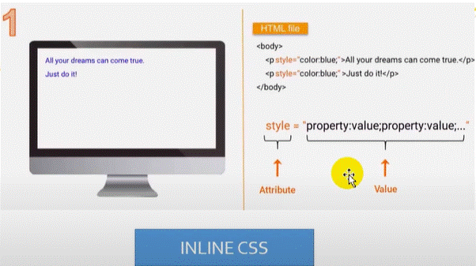
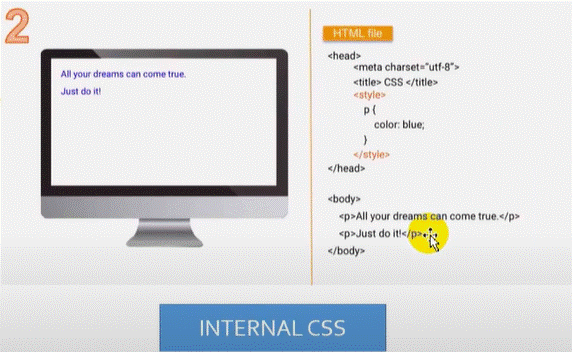
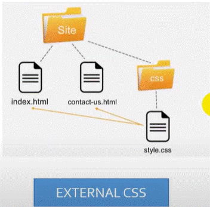
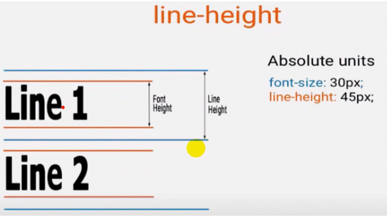
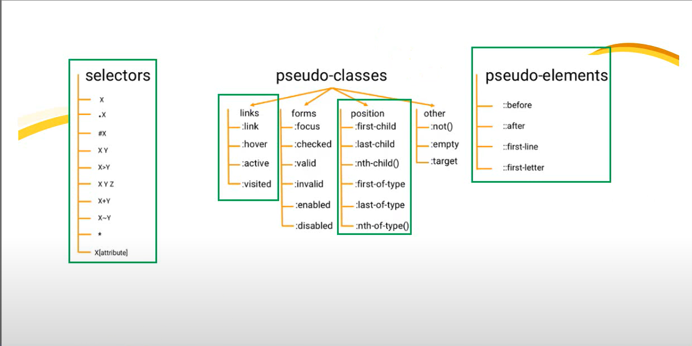
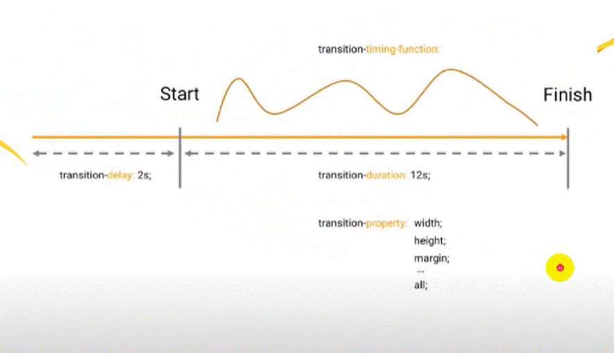

# **LESSON 19: Frontend**
## HTML
*   **HTML** là chữ viết tắt của Hypertext Markup Language. Nó giúp người dùng tạo và cấu trúc các thành phần trong trang web hoặc ứng dụng, phân chia các đoạn văn, heading, links, blockquotes, vv...

## CSS
*   **CSS** là ngôn ngữ tạo phong cách cho trang web - Cascading Style Sheet language. Nó dùng để tạo phong cách và định kiểu cho những yếu tố được viết dưới dạng ngôn ngữ đánh dấu, như là HTML.
*   Những thuộc tính nằm trong 1 thẻ mở của html gọi là attribute
 
### *CSS in HTML?*
*   **inline** : viết vào luôn trong 1 thẻ mở nằm trong attribute style

*   **internal** : viết vào bất cứ đâu của file html miễn là nó hợp lệ, nằm trong thẻ style trong file html

*   **external** : sử dụng 1 file css ở ngoài và link file đó vs file html cần css

### *CSS selector? cách để gọi đến các phần tử trong html để css*
*   **ID:** Trong một file html không được đặt tên ID trùng nhau
*   Khi select tới đối tượng mà sử dụng ID thì trong file css: #name-id { thuộc tính: giá trị;}
*   **Class:** sử dụng một lớp chp nhiều đối tượng khác nhau
*   Khi select tới đối tượng mà sử dụng Class thì trong file css: .name-class { thuộc tính: giá trị;}

Priority in CSS?

    1. internal, external?
        cái nào được gọi sau thì sẽ ưu tiên cái đó
    2. inline - 1000
    3. #id - 100
    4. .class - 10
    5. tag - 1
        khi một phần tử được gọi bởi nhiều các (2, 3, 4, 5) thì cách nào có nhiều điểm
        hơn thì độ ưu tiên nhiều hơn

    6. equal speccificity? 
        selector khi gọi tới element thì ông nào lớn hơn lại được ưu tiên
        khi một element có cả id và class thì cộng điểm id và class của element đó lại 
        ông element nào nhiều điểm hơn thì ưu tiên hơn
    7. universal selector and inherited? 
        nếu xét điểm cho ông này thì ổng chỉ có 0 điểm
        ex1: * {thuộc tính: giá trị};
        ex2: html {thuộc tính: giá trị};
    8. ex: * {thuộc tính: giá trị !important}; ưu tiên nhất

### *CSS Variable*
    : root {
        --text-color: red; 
    }
    h1 {
        color: var(--text-color);
    }

### *CSS unit*
    font-size default = 16px
    1. Absolute units?
    px
    pt 
    cm 
    mm 
    inch 
    pc 
    2. Relative units? -> cần có giá trị để phụ thuộc vào
    %   phụ thuộc vào thẻ chứa nó
    rem phụ thuộc vào font-size của thẻ html 
    em  phụ thuộc vào thẻ cha gần nhất chứa nó chứa thuộc tính font-size
    vw  viewport-width
    vh  viewport-height
    vmin 

### *Color*
    Color name

    linear-gradient(45deg, rgba(,,,))

    Hexadecimal (HEX) #RedGreenBlue

### *CSS The float property*

    The float property is used for positioning and formatting content e.g. let an image float left to the text in a container.
    The float property can have one of the following values:

    left - The element floats to the left of its container

    right - The element floats to the right of its container

    none - The element dose not float (will be displayed just where it occurs in the text). This is default
    
    inherit - The element inherits the float values of its parent

### *CSS The clear property*

    The clear property specifies what element can float beside the cleared element and on which side.
    The clear property can have one of the following values:

    none - Allows floating elements on both sides. This is default

    left - No floating elements allowed on the left side
    
    right - No floating elements allowed on the right side

    both - No floating elements allowed on either the left or the right side

    inherit - The element inherits the clear value of its parent

### *CSS Pseudo classes*
    :root
    :hover
    :active
    :first-child
    :last-child 

### *CSS Pseudo elements*
    ::before
    ::after
    ::first-letter
    ::first-line
    ::selection

### *CSS Position*
    Relative -> là vị trí tương đối vào lấy chính mình làm gốc tọa độ

    CSS Position: Absolute -> là vị trí tuyệt đối phụ thuộc vào thẻ cha gần nhất có thuộc tính position để nó lấy position 

### *Làm sao để phân biệt thằng nào sẽ dùng fixed và thằng nào sẽ dùng absolute?*
    -> khi các bạn thấy một đối tượng phụ thuộc vào một đối tượng khác trên html thì lúc đó 
    các bạn sẽ sử dụng position: absolute. Còn khi các bạn thấy một đối tượng phụ thuộc vào 
    cửa sổ trình duyệt thì sử dụng position: fixed

### *4 main font families*

### *Safe fonts and fallback*

*   Thay vì dùng mặc định các font thì mk có thể sử dụng các font của fonts google

### *line-height*

### *Reset CSS*

    The goal of a reset stylesheet is to reduce browser inconsistencies in things like default line height, margins and font sizes of headings, and so on

### *Border Padding Margin*

### *Background*

1.  background-color
2.  background-image
3.  background-size
4.  background-repeat
5.  background-position
6.  background-attachment

### *Position*
    static: default

    absolute: di chuyển đến vị trí mới so với cha của nó, nhưng yêu cầu cha của nó phải relative

    relative: di chuyển đến vị trí mới so với vị trí thực tế của nó trước đó

    fixed: di chuyển đến vị trí mới so <html>, không bị ảnh hưởng bởi scrolling

### *Advanced selector*

### *Transition*

### *FlexBox*

### *Bản chất bên trong Flex*

*   flex-grow
*   flex-basis
*   flex-shrink

