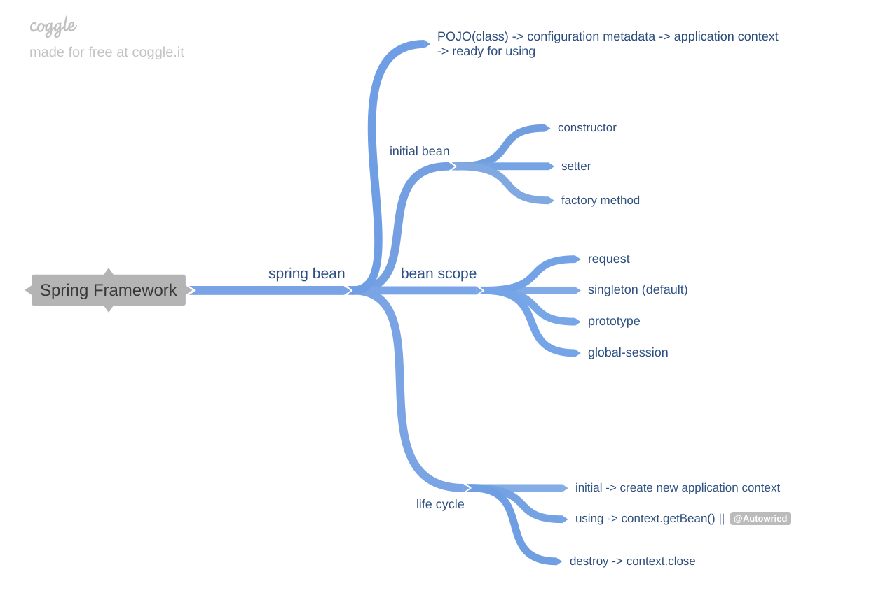

<h1>Spring Framework</h1>

<h2>Spring overview and Spring core(AT)</h2>

<h2>Spring AOP and Aspect J</h2>

--> startTransaction
    
    ==> setAutoCommit(false)

    before(aspect)

    @Transaction
    doSomeThing() {
        update
        add
    }

    after(aspect)

--> endTransaction

    ==> COMMIT

+   Join Point: Function, chức năng sẽ được thực thi (cần aspect)
    -> VD: doSomeThing()

+   Aspect: before, after, around advices

    ==> Interceptors: đánh chặn, được gọi trước, sau, trong khi gọi cái Join Point

    ==> before(start function)
    ==> after(end function)

+   PointCut: điều kiện thõa mãn Joint Point
    ==> Điều kiện để áp dụng Advice nào cho cái Joint Point nào

+   AOP proxy (created by AOP framework)
    +   JointPoint
    +   Advice
    +   JointCut

